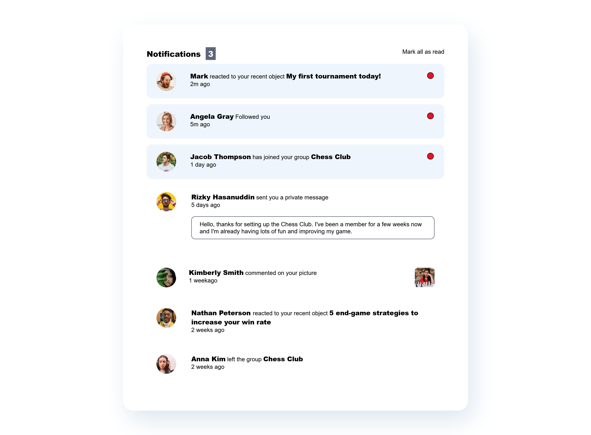

# Frontend Mentor - Notifications page solution

This is a solution to the [Notifications page challenge on Frontend Mentor](https://www.frontendmentor.io/challenges/notifications-page-DqK5QAmKbC). Frontend Mentor challenges help you improve your coding skills by building realistic projects. 

### The challenge

Users should be able to:
- Distinguish between "unread" and "read" notifications
- Select "Mark all as read" to toggle the visual state of the unread notifications and set the number of unread messages to zero
- View the optimal layout for the interface depending on their device's screen size
- See hover and focus states for all interactive elements on the page

### Screenshot

### Links

- Solution URL: [Add solution URL here](https://your-solution-url.com)
- Live Site URL: [Add live site URL here](https://your-live-site-url.com)

## My process

- I initially used bootstrap but later found out that firefox does not render bootstrap and I sometimes forgot about the existence of bootstrap class so I deleted the boostrap styles. 

### Built with
- Semantic HTML5 markup
- CSS custom properties
- Flexbox
- CSS Grid
- Mobile-first workflow
- vanilla JS

### What I learned

The main thing is that it strengthed my understanding of CSS grid layout. 

### Continued development

The layout on small devices does not look great when there is an image on the right of the notification page

### Useful resources

- [JS DOM manipulation](https://bobbyhadz.com/blog/javascript-check-if-element-was-clicked) - This helped me for checking click event in js.
- [CSS grid](https://css-tricks.com/almanac/properties/g/grid-template-columns/) - This is an amazing article which helped me finally understand grid in CSS.

## Author

- Frontend Mentor - [@zhangXilong-Edward](https://www.frontendmentor.io/profile/zhangXilong-Edward)

